### Distributions of Cases, Prevalence, and Incidence

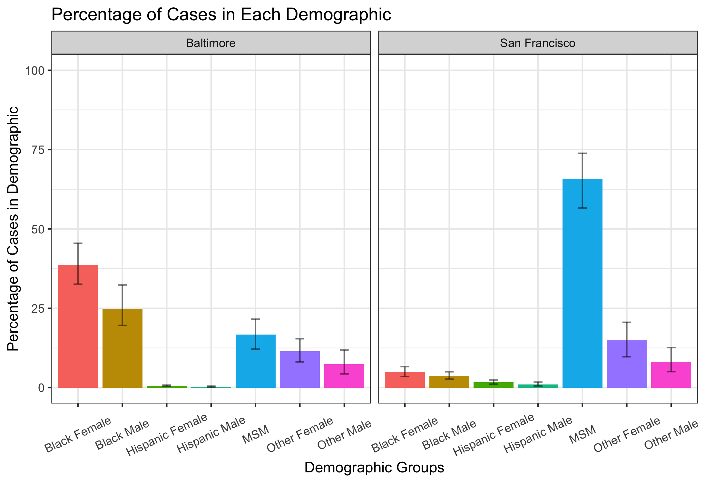

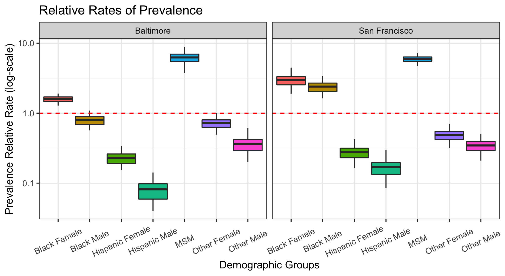

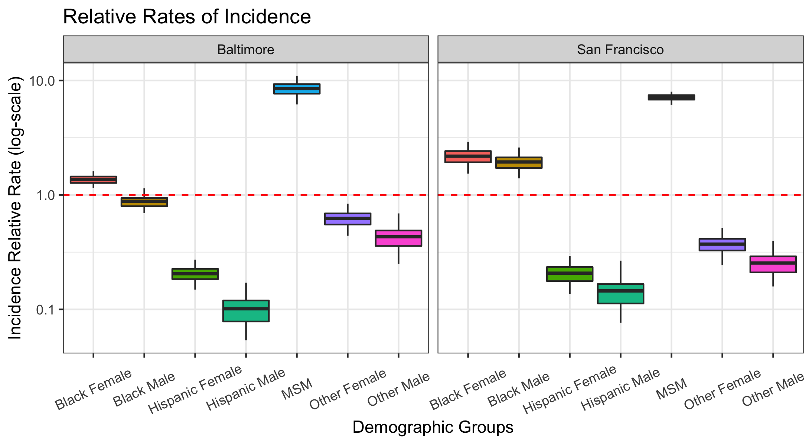

### Prevalence Time Trends in Intervention Scenarios

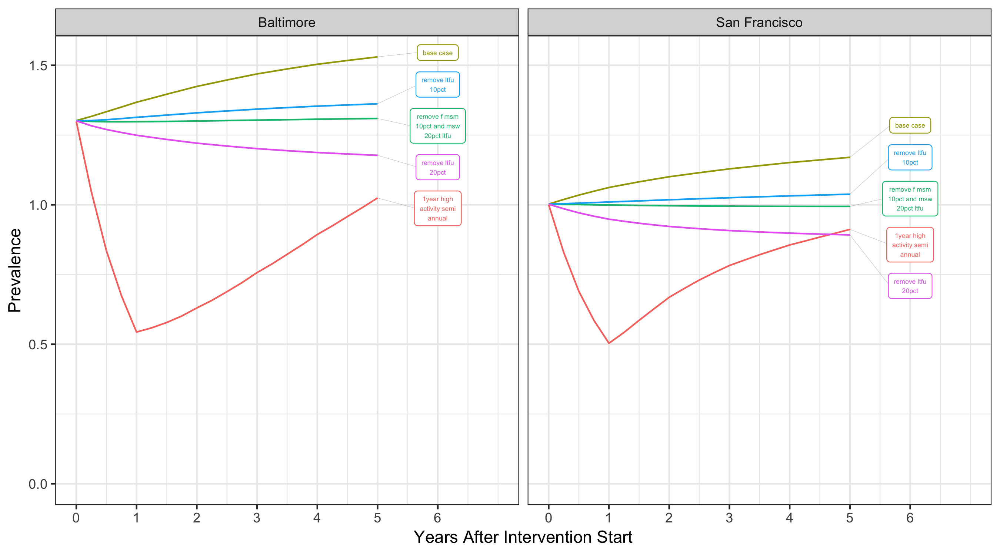

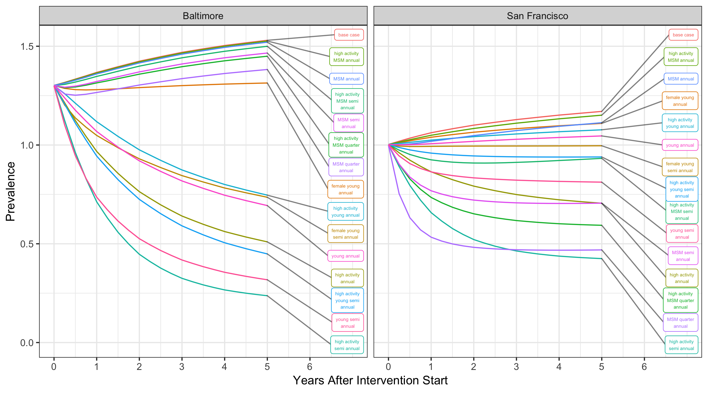

### Relative Reductions in Prevalence

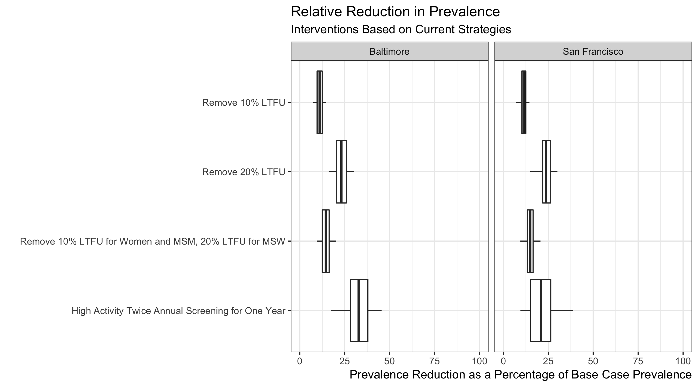

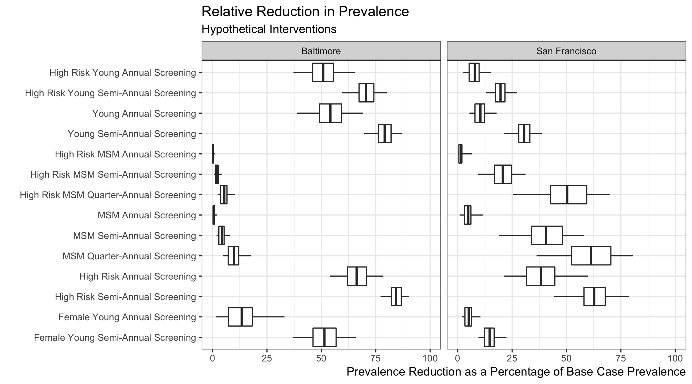

### Additional Tests and Cases Averted

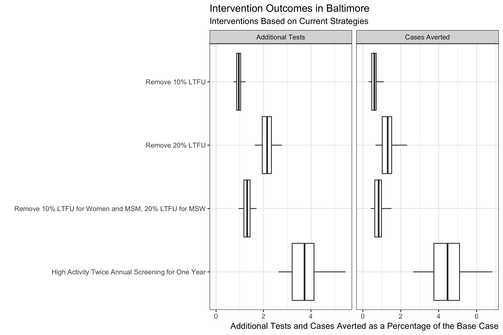

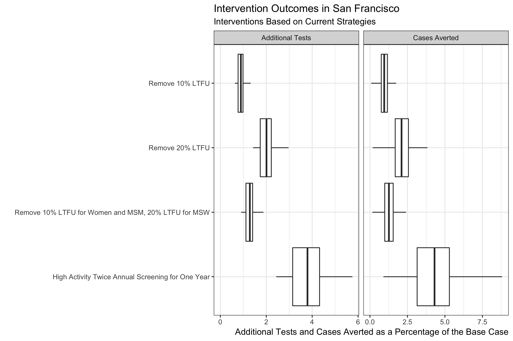

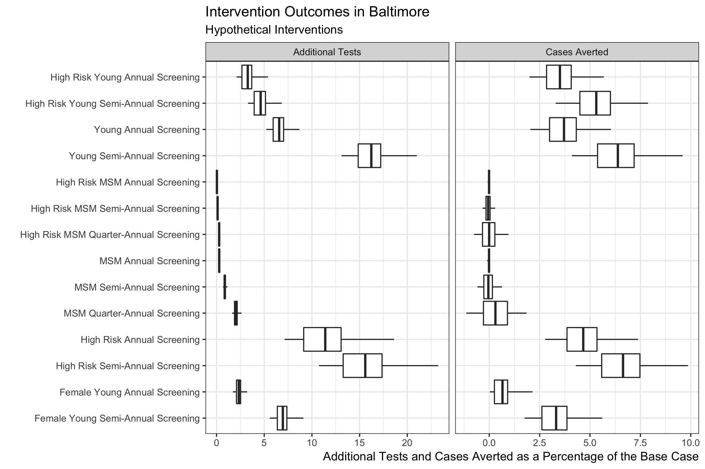

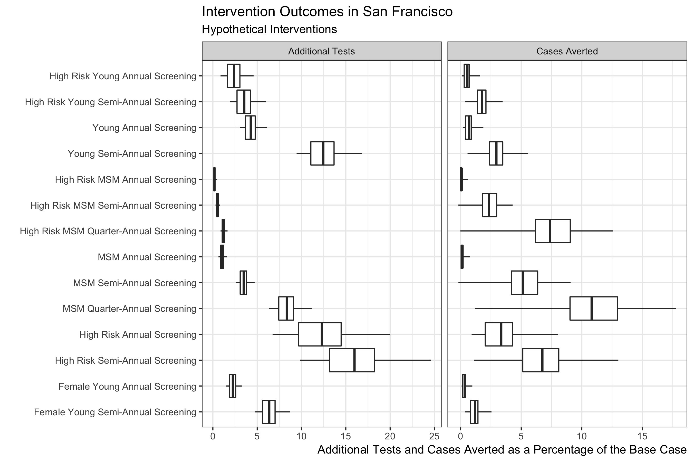
